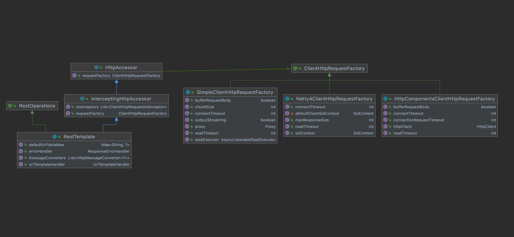

# rest-template-with-apache

Spring RestTemplate을 기본 구현체가 아닌, 더 확장된 기능을 제공하는 Apache HttpClient 구현체로 확장해보자.

## Spring RestTemplate의 클래스 다이어그램

## Apache HttpClient
문서 : https://hc.apache.org/httpcomponents-client-4.5.x/index.html \
version : 4.5.13